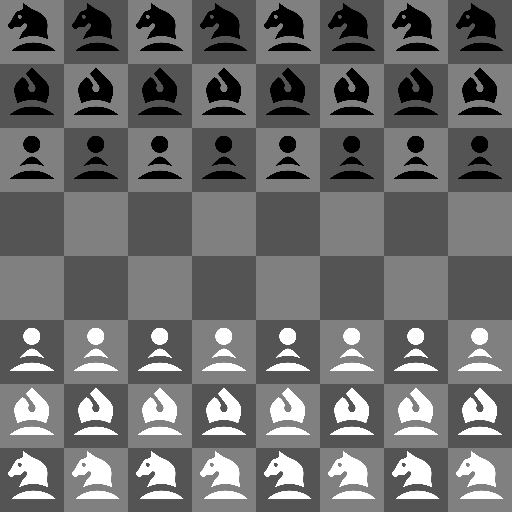

# longbow-gui
a gui for longbow

## Installation
git clone this, cd into the cloned directory and run:

```bash
nimble build
```

This will install any needed libraries and build a **longbow-gui** executable. This requires a copy of the longbow binary in the same folder to run. You can use the one included for linux64 or compile it from here:

https://github.com/freevryheid/longbow

Parameters include:
  * -h   : help
  * -b   : play as black (default = false)
  * -d:x : where x is depth of search (default = 5)

## credits
The chess pieces are from the chess font by James Kilfiger



